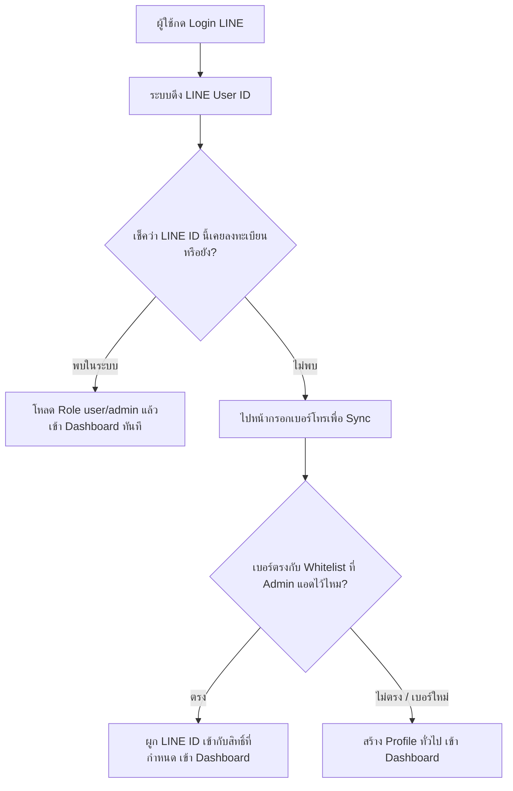

# 🍺 คู่มือการเชื่อมต่อ Supabase + Vercel + ระบบ Admin Security

---

## 📌 1. วิธีสร้างและตั้งค่า Supabase (PostgreSQL)

1. เข้าเว็บ [https://supabase.com](https://supabase.com) แล้ว Login
2. กด **"New Project"**
   - **Name**: `DrinkSplit`
   - **Database Password**: ให้ใช้รหัสผ่านความปลอดภัยสูง เช่น:
     `D$k#9xLp!2026@SupAbasE_DevSec`
   - **Region**: เลือก `Singapore (ap-southeast-1)` (เร็วที่สุดสำหรับไทย)
3. เมื่อสร้างโปรเจคเสร็จ ไปที่เมนู **SQL Editor** ทางซ้าย
4. เปิดไฟล์ในโปรเจคนี้ [supabase/schema.sql](file:///d:/DrinkSplit/supabase/schema.sql) คัดลอกโค้ดทั้งหมดไปวางแล้วกด **"Run"**
   - จะสร้างตาราง `profiles`, `authorized_phones`, `drink_split_sessions`, `drink_split_members`, `drink_split_items`
   - มีการตั้งสิทธิ์ Admin ให้ LINE ID ของคุณ (`Ue35a517c95d66444fd5bd784ebf96886`) ทันที!
5. ไปที่เมนู **Project Settings** (รูปเฟือง) -> **API**
   - คัดลอก **Project URL**
   - คัดลอก **anon / public key**
   - คัดลอก **service_role key** (Secret)

---

## 📌 2. นำค่า Key มาใส่ใน `.env.local`

เปิดไฟล์ [.env.local](file:///d:/DrinkSplit/.env.local) แล้วแทนที่ค่า:

```env
NEXT_PUBLIC_SUPABASE_URL=https://xxxxxxxxxxxxxxxxxxxx.supabase.co
NEXT_PUBLIC_SUPABASE_ANON_KEY=eyJhbGciOi...
SUPABASE_SERVICE_ROLE_KEY=eyJhbGciOi...
```

---

## 📌 3. วิธีเชื่อมต่อขึ้น Vercel

1. Push โค้ดขึ้น GitHub ผ่าน Sourcetree
2. เข้าเว็บ [https://vercel.com](https://vercel.com) แล้วกด **"Add New Project"**
3. เลือก Repository `DrinkSplit` จาก GitHub
4. ในหน้าตั้งค่าก่อนกด Deploy ให้เปิดหัวข้อ **Environment Variables** แล้วเพิ่มค่าเหล่านี้:
   - `NEXT_PUBLIC_APP_URL` = `https://<your-project>.vercel.app` (หรือปล่อยว่างระบบจะ detect อัตโนมัติ)
   - `LINE_CHANNEL_ID` = `2011158442`
   - `LINE_CHANNEL_SECRET` = `becbd0a21796337e9e3881a65f709503`
   - `NEXT_PUBLIC_SUPABASE_URL` = `ค่าจาก Supabase`
   - `NEXT_PUBLIC_SUPABASE_ANON_KEY` = `ค่าจาก Supabase`
   - `SUPABASE_SERVICE_ROLE_KEY` = `ค่าจาก Supabase`
   - `SESSION_SECRET` = `K#89m$Lq!wZ2026@SecUre_J_W_T_TokEn`
5. กด **"Deploy"**
6. เมื่อได้ URL บน Vercel เช่น `https://drinksplit.vercel.app`
   ให้นำ URL Callback ไปใส่ใน [LINE Developers Console](https://developers.line.biz/):
   - `https://drinksplit.vercel.app/api/auth/line/callback`

---

## 📌 4. Flow การทำงานของระบบ Admin & Phone Sync


